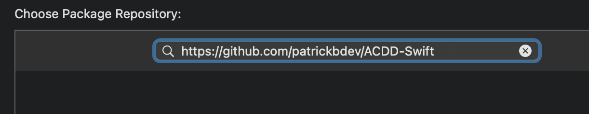
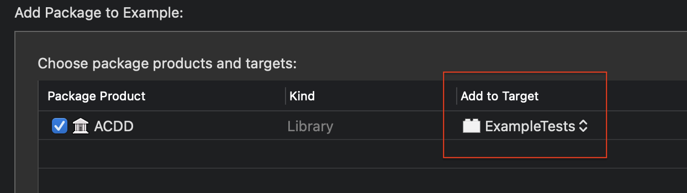

# Acceptance Criteria Driven Development

<p align="center">
    
    <br>
    <a href="https://swiftpackageindex.com/patrickbdev/ACDD-Swift"></a>
    <a href="https://swiftpackageindex.com/patrickbdev/ACDD-Swift"></a>
    <br>
    <a href="https://github.com/apple/swift-package-manager" alt="ACDD on Swift Package Manager" title="ACDD on Swift Package Manager"></a>
    <a href="https://github.com/patrickbdev/ACDD-Swift/actions/workflows/swift.yml"></a>
    <a href="https://codecov.io/gh/patrickbdev/ACDD-Swift"></a>
	<br>
    Acceptance criteria driven development provides simple types for structuring scenario-oriented tests (<i>given</i>, <i>when</i>, <i>then</i>) to make following <a href="https://en.wikipedia.org/wiki/Behavior-driven_development">behavior-driven development</a> in Swift easier.
</p>


## Installation

### SPM
1. Add the following to your project:  
`https://github.com/patrickbdev/ACDD-Swift`  


2. **Set the `Add to target` to your test target**  


3. Import the module to a test file with:  
`import ACDD`

## Usage

```swift
func test_success() throws {
    
    var calculator = SumCalculator()
    
    try AC(scenario: "Calculator should be able to sum")
        .given("4 is entered into the calculator") {
            calculator.firstNumber = 4
        }
        .and("5 is entered into the calculator") {
            calculator.secondNumber = 5
        }
        .when("the sum is computed") {
            try calculator.computeSum()
        }
        .then("the output is 9") {
            XCTAssertEqual(calculator.output!, 9)
        }
}
```


### Logging

Logging is handled through the `LoggerType` protocol.
You can create your own logger by adhering to this protocol and linking it using one of the below methods.
This package comes with a `SimpleLogger` that prints to console like so:

```
AC - Calculator should be able to sum
- GIVEN 4 is entered into the calculator
- AND 5 is entered into the calculator
- WHEN the sum is computed
- THEN the output is 9
```

#### Default Logger

Set the same logger for all `AC`s with:

```swift
ACDD.defaultLoger = SimpleLogger()
```
This would be best placed in a location that runs before any tests.
[Suggestions in this SO post.](https://stackoverflow.com/a/41895011/4698501)

#### Per AC

Set a logger per `AC` with:

```swift
AC(scenario: "The world should not end", logger: HadronColliderLogger())
```


## Notes

### Ordering

ACDD enforces ordering.

- The order is `given`, `when`, `then`.
- Any number of `and`s are allowed after each of the above clauses.
- How will you know if you've got the wrong order? The code won't compile 😉

### Omit handler

Every code handler is optional as there isn't always a need to write code. An example could be:  

```swift
func test_no_input() throws {
    
    var calculator = SumCalculator()
    
    try AC()
        .given("no numbers have been entered into the calculator")
        .when("the sum is computed") {
            XCTAssertThrowsError(try calculator.computeSum())
        }
        .then("an error occurs")
}
```

### Omit given

Omitting `given` is allowed. This is helpful when applying BDD to UI development. Example:

```swift
func test_text_exists() throws {
    
    var contentView: ContentView!
    
    try AC()
        .when("the screen appears") {
            contentView = ContentView()
        }
        .then("I can see `Hello, world!`") {
            let inspection = try contentView.inspect()
            XCTAssertNoThrow(try inspection.find(text: "Hello, world!"))
        }
}
```
The above uses [ViewInspector](https://github.com/nalexn/ViewInspector/)


### Exceptions

Every clause function rethrows a handler's error to remove the need to fill your tests with verbose `do {} catch {}`. If you want to opt into this, add:

- `try` before `AC`
- `throws` after your test function declaration
